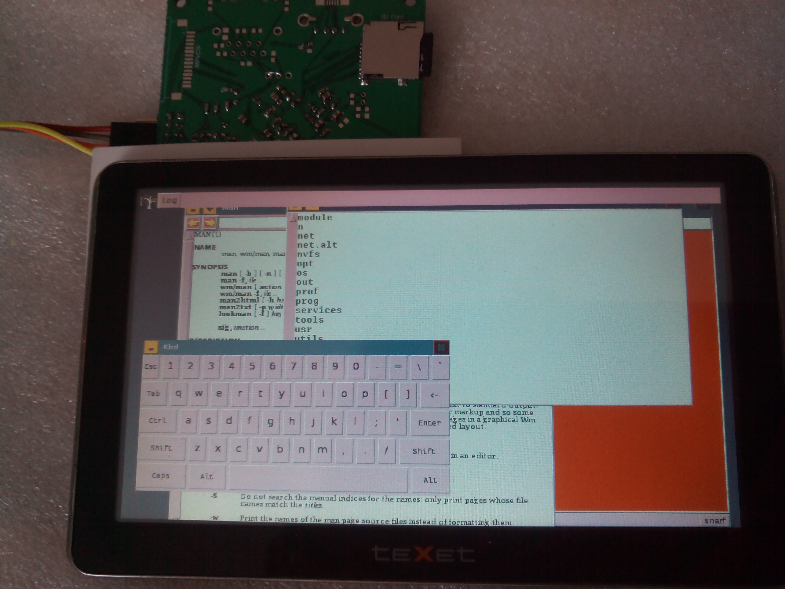

main build board now is `Blueberry Pi 7.1.2.esp32.no-lan.gsm-a9g`. because `a9g` gsm module is much better then `sim800c`. because of open source SDK and support of GPS.

but still work-in-progress. not finished.

sources of Linux kernel (4.10.15) for this board(s). preconfigured:
https://github.com/bhgv/linux

precompiled Linux-4.10.15 SD-image with support of fb-graphics an resistive touch:
https://github.com/bhgv/linux/releases/tag/1.0a

Blueberry Pi 7.1.2.esp32.no-lan
===============================
(not finished yet)
* removed lan port,
* added 50pins fpc RGB connector for popular 7" tfts (AT070TN[90, 91, 92, 93, 94]) in parallel to 40pins one,
* connector for capacitive touchscreens (i2c1),
* power converters for 50pins socket,
* 25% smaller board.
* esp32 now wired as wifi/bluetooth and as io expander-coprocessor.

Blueberry Pi 7.1.1+ESP32-S
==========================
(not finised yet)
* other power controller(s). 3 cheap and easy to solder chips in sot23-6,
* a try to use ESP32-S module as a WiFi/Bluetooth co-processor.

List of compatible (and cheap) LCDs (with touchscreens)
=======================================================
* ? 7" -- MDT7000
* 7" -- TKR7040B
* 7" -- GL070009T0-40

* 6" -- KD060G1-40nc-a5
* 6" -- TM060RDH02

* 5" -- HSD050IDW1-A20
* 5" -- MH0506D
* 5" -- KD50G21-40NT-A1
* 5" -- A26TF9C032169 * A0 -A20
* 5" -- H-H050L-12M
* 5" -- GL050001C0-40
* 5" -- ft050s800480005n-v01
* 5" -- HW800480F-0F-0L-20
* 5" -- hw800480f-0f-0l-10
* 5" -- T050SWV012T
* 5" -- T050SWV015T
* 5" -- FC050S151-01
* 5" -- KD50G23-40NB-A1
* 5" -- HLY050ML115-12A

(
* 6" -- texet tn-811bt

* 5" --
- Window N5 TOP Tablet PC/ N5PRO/ Onda 580
- TeXet T-939HD
- TeXet T-930HD
- TeXet TN-550A
- TeXet TN-511HD
- TeXet TN-521HD
- TeXet TN-610HD
- TeXet TN-611HD
- TeXet TM-650 (100%)
- Explay PN-955
- Explay PN-960
- SHTURMANN Play 500
- IQU Smile
- Lexand Si-515 Pro HD
- Lexand SG-615 PRO HD
- Ritmix
- EasyGo 500Bi (100%)
- lexand str-5350 hd (100%)
- Prestigio Geovision 5500BTFMHD (100%)
- Prestigio GeoVision 5600GPRSHD
- Explay SLK5
- JXD S5300
- TurboGames New
- EXEQ SET
)

Blueberry Pi 7.1+axp203
=======================
is the Blueberry Pi 7.1 board but with AXP203 power controller, not EA3036. and has DC-DC step down (5-12v) on power input.

Blueberry PI 7.1
================

Added:
------
* LVDS interface with cheap SN65LVDS84 serialiser,
* resistive touchscreen controller TSC2003 + pinheader for resistive touch,
* flash w25q128,
* more popular MicroSD card slot,
* datasheets for them

Removed:
--------
* pinheader for OV7670

Blueberry PI
============
Another fruit single board computer (SBC), based on the Allwinner V3s system on a chip (SOC).
The Allwinner V3s comes in an easy to solder 128pin TQFP package.

The Blueberry PI features:

- 100 mbps Ethernet
- 1 USB Host Port / 1 mini USB port
- MIPI CSI interface (unfortunately no support in the linux kernel yet)
- Pinheader for an OV2640 and an OV7670
- Wifi and bluetooth
- RGB interface for connecting displays
- Audio jack
- an onboard microphone
- four buttons for play, pause, next and previous
- a Raspberry PI compatible header
- SPI Flash
- SD card slot

The Blueberry PI can boot from an SD card or SPI Flash.
Since the V3s doesn't have a standard video output, I'm planning on creating a video addon board which provides VGA or HDMI. In combination with the ADV7611 it is possible to capture HDMI.

If you have any questions email me at marcel[dot]thuermer(at)smail[dot]emt[dot]h[minus]brs[dot]de
